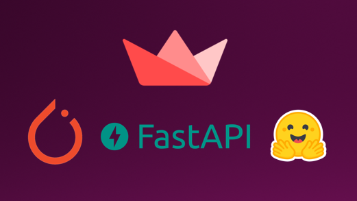

<h1 align="center">Project Insight</h1>

<h2 align="center">NLP as a Service</h2>




<p align="center">
<a href="https://github.com/abhimishra91/insightissues"></a>
<a href="https://github.com/abhimishra91/insight/network"></a>
<a href="https://github.com/abhimishra91/insight/stargazers"></a>
<a href="https://github.com/abhimishra91/insight/blob/master/LICENSE"></a>
<a href="https://github.com/abhimishra91/insight/blob/master/LICENSE"></a>
<a href="https://github.com/abhimishra91/insight/"></a>
</p>

## Introduction

Project Insight is designed to create NLP as a service with code base for both front end GUI (**`streamlit`**)  and backend server (**`FastApi`**) the usage of transformers models on various downstream NLP task.

The downstream NLP tasks covered:

* News Classification

* Entity Recognition

* Sentiment Analysis

* Summarization

* Information Extraction `To Do`

The user can select different models from the drop down to run the inference.

The users can also directly use the backend fastapi server to have a command line inference. 

### Features of the solution

* **Python Code Base**: Built using `Fastapi` and `Streamlit` making the complete code base in Python.
* **Expandable**: The backend is desinged in a way that it can be expanded with more Transformer based models and it will be available in the front end app automatically. 

## Installation

* Clone the Repo.
* Run the `Docker file` to create the Docker images.
* Run the `Docker images` to start the front end and back end. service

## Project Details

### File Details

* Front End: Front end code is in the `src_streamlit` folder. Along with the `Dockerfile` and `requirements.txt`

* Back End: Back End code is in the `src_fastapi` folder.
    * This folder contains script for each task: `classificationpro.py`, `nerpro.py`, `sentimentpro.py`...
    * `app_fastapi.py` is the main application file that calls each servie based on the api call made by the front end.
    * Each NLP task has its own folder and within each folder each trained model has 1 folder each. For Example
    ```
    - sentiment
        - distilbert
            - model.bin
            - network.py
            - tokeniser.json
        -roberta
            - model.bin
            - network.py
            - tokeniser.json
    ```
    * For each new model under each service a new folder will have to be added.
    * Each folder model will need the following files:
        * Model bin file.
        * Tokenizer files
        * `network.py` Defining the class of the model if customised model used.

## API Reference

## Technology Used

## License

